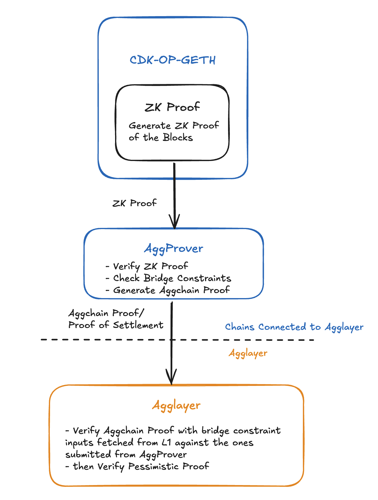
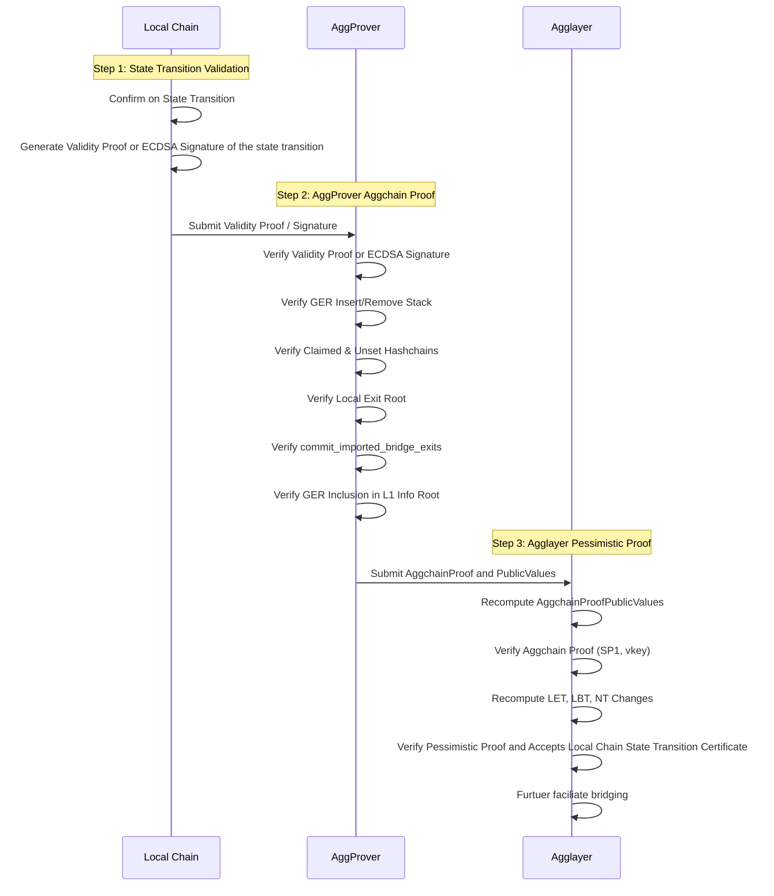

# Agglayer v0.3.0 Documentation

## Table of Contents
- [Background](#background)
  - [Problem Statement](#problem-statement)
  - [What is Agglayer?](#what-is-agglayer)
  - [What is a Unified Bridge?](#what-is-a-unified-bridge)
  - [What is a Pessimistic Proof?](#what-is-a-pessimistic-proof)
- [Proof of Settlement](#proof-of-settlement)
  - [Aggchain Proof](#aggchain-proof)
    - [Aggchain Proof Data Structure](#aggchain-proof-data-structure)
    - [Execution](#execution)
  - [ECDSA Verification](#ecdsa-verification)
    - [Description](#description-1)
    - [Execution](#execution-1)
  - [Validity Proof Verification](#validity-proof-verification)
    - [Description](#description-2)
    - [Execution](#execution-2)
- [Components](#components)
  - [Local Chain](#local-chain)
  - [AggProver](#aggprover)
  - [AggSender](#aggsender)
  - [AggOracle](#aggoracle)
- [How It Works](#how-it-works)
  - [Step 1 zkVM: Initial State Transition Validation](#step-1-zkvm-initial-state-transition-validation)
  - [Step 2: AggProver Aggchain Proof](#step-2-aggprover-aggchain-proof)
  - [Step 3: Agglayer Pessimistic Proof](#step-3-agglayer-pessimistic-proof)
- [Changes from v0.2 to v0.3](#changes-from-v0.2-to-v0.3)

## Background

### Problem Statement
In the early versions of Agglayer, the system only focused on securing cross-chain transactions through a single verification method. While this approach worked for basic cross-chain operations, it didn't verify whether the individual chains themselves were operating correctly. Think of it like having a security guard only checking IDs at the entrance of a building, but not verifying if the building's internal systems are functioning properly.

The v0.3 release introduces a more comprehensive security approach, similar to having both a building security system and a security guard. First, it verifies that each chain is operating correctly by checking its internal state transitions (like verifying that all transactions are valid and balances are correct). Then, it verifies the cross-chain operations to ensure assets are being transferred safely between chains. This dual-layer security system allows different types of chains to participate in the network using their preferred verification methods - whether they're using advanced execution proofs or simpler consensus mechanisms. By implementing this two-step verification process, Agglayer v0.3 provides an extra layer of security, making cross-chain transfers significantly more secure while maintaining flexibility for different types of blockchain networks.

### What is Agglayer?
Agglayer is a revolutionary protocol that addresses the fundamental challenge of blockchain fragmentation by creating a unified framework for cross-chain interoperability. At its core, it serves as an aggregation layer that sits between blockchain ecosystems, offering three key phases of operation: Pre-Confirmation (verifying dependencies), Confirmation (validating proofs), and Finalization (aggregating proofs into a single proof posted to Ethereum). The protocol enables unified liquidity sharing, low-latency interoperability, and asset fungibility across connected chains, without compromising chain sovereignty or decentralization. It achieves this through sophisticated components including the Unified Bridge for cross-chain operations, Pessimistic Proof System for state verification, and various supporting services like AggProver, AggSender, and AggOracle.

What sets Agglayer apart is its ability to provide atomic and asynchronous interoperability while maintaining safety and modularity. The protocol ensures cryptographic guarantees against malicious actions like double-spending, enables cross-chain transactions to execute as atomic bundles, and allows chains to interact safely without waiting for Ethereum finality. This design creates a Web3 experience that feels unified, similar to how TCP/IP unified the internet. For example, users can transfer ETH from Polygon to mint NFTs on Zora in a single transaction without using third-party bridges or wrapped tokens. The protocol's intentionally minimal design focuses on safety and interoperability while allowing chains to retain their sovereignty and choose their level of integration, making it a potential backbone for a truly unified decentralized future.

### What is a Unified Bridge?
The Unified Bridge is a fundamental component of the Agglayer ecosystem that facilitates seamless cross-chain communication and asset transfers between different networks. It consists of three main components: Bridge Contracts (smart contracts deployed on each network to handle bridging operations), Bridge Service (manages inter-network communication and synchronizes global exit roots), and Tools (utilities for proof generation and verification). The bridge supports two primary operations: Asset Bridging for transferring tokens and other assets between networks, and Message Bridging for cross-chain communication. To maintain security and consistency, it employs several key data structures including Local Exit Root (LER), Rollup Exit Root, Mainnet Exit Root, Global Exit Root, L1 Info Tree, and Global Index. This standardized interface ensures secure and efficient cross-chain operations while providing a unified approach to bridging different networks within the Agglayer ecosystem.

For a more detailed understanding of the Unified Bridge architecture, implementation, and usage, please refer to the [Agglayer Unified Bridge Repository](https://github.com/BrianSeong99/Agglayer_UnifiedBridge).


### What is a Pessimistic Proof?
The Pessimistic Proof is a critical security mechanism in Agglayer that verifies state transitions across different networks. It works through a four-step process: First, local chains prepare their state data and transition information in a Certificate format, which includes previous and new local exit roots, bridge exits, and imported bridge exits. Second, the Agglayer client populates a MultiBatchHeader using this certificate data. Third, the system runs the Pessimistic Proof program in native Rust to verify the state transition's validity, comparing the computed new state with the expected state in the batch header. Finally, the same program is executed in a zkVM (currently using SP1 Provers Network from Succinct Labs) to generate a zero-knowledge proof of the computation. The system uses several key data structures including PessimisticProofOutput (which contains roots and hashes of the state transition), Certificate (representing a chain's state transition), and various tree structures for tracking balances and nullifiers. This proof system is designed to be flexible and secure, supporting both ECDSA and Generic consensus types, while maintaining compatibility with existing systems.

For a more detailed understanding of the Pessimistic Proof architecture, implementation, and usage, please refer to the [Agglayer Pessimistic Proof Repository](https://github.com/BrianSeong99/Agglayer_PessimisticProof_Benchmark).


# Proof of Settlement

Proof of Settlement is a fundamental concept in Agglayer that ensures the security and validity of cross-chain operations. Think of it as a comprehensive verification system that works in two layers:

1. **Internal Settlement Verification(Validity Proof)**: This layer verifies that each chain's internal state transitions are valid. It's like checking that all transactions within a chain are properly executed and the chain's state is consistent. This is done via Validity Proof: A detailed verification of every operation in the chain, and other verification type can be added in the future.

2. **Cross-Chain Settlement Verification(Aggchain Proof & Pessimistic Proof)**: This layer verifies that cross-chain operations (like asset transfers between chains) are valid. It ensures that when assets move between chains, the operations are atomic and secure.

The combination of these two layers provides a robust security model - both the internal chain operations and the cross-chain transfers must be verified for a transaction to be considered valid. This dual-layer approach ensures that Agglayer can maintain security while supporting different types of chains with varying consensus mechanisms.



*Highlevel overview of the v0.3 trust flow, more details in later sections*

## Aggchain Proof

Aggchain Proof is a flexible verification system in Agglayer that supports different types of consensus mechanisms for proving chain state transitions. Think of it as a universal adapter that can work with various types of chains, whether they use simple signature-based verification or more complex proof systems.

The system supports two main types of proofs:

1. **ECDSA Signature**: A simpler verification method where a trusted sequencer signs off on state changes. This is like having a security guard verify and approve changes to a building's access system.

2. **Generic Proof**: A more flexible system that can work with any type of chain-specific proof system. This is like having a universal translator that can understand and verify different types of security protocols.

The key innovation of Aggchain Proof is its ability to combine these different proof types with bridge verification, ensuring that both the chain's internal operations and cross-chain transfers are secure. This flexibility allows Agglayer to support a wide range of chains while maintaining strong security guarantees.

### Aggchain Proof Data Structure
```rust

/* -------- AggProver input data -------- */
// Witness Data structure
pub struct AggchainProofWitness {
    /// Previous local exit root.
    pub prev_local_exit_root: Digest,
    /// New local exit root.
    pub new_local_exit_root: Digest,
    /// L1 info root used to import bridge exits.
    pub l1_info_root: Digest,
    /// Origin network for which the proof was generated.
    pub origin_network: u32,
    /// Full execution proof with its metadata.
    pub fep: FepInputs,
    /// Commitment on the imported bridge exits minus the unset ones.
    pub commit_imported_bridge_exits: Digest,
    /// Bridge witness related data.
    pub bridge_witness: BridgeWitness,
}

pub struct BridgeWitness {
    /// List of inserted GER minus the removed ones.
    pub inserted_gers: Vec<InsertedGER>,
    /// Raw list of inserted GERs which includes also the ones which get
    /// removed.
    pub raw_inserted_gers: Vec<Digest>,
    /// List of removed GER.
    pub removed_gers: Vec<Digest>,
    /// List of the each imported bridge exit containing the global index and
    /// the leaf hash.
    pub bridge_exits_claimed: Vec<GlobalIndexWithLeafHash>,
    /// List of the global index of each unset bridge exit.
    pub global_indices_unset: Vec<U256>,
    /// State sketch for the prev L2 block.
    pub prev_l2_block_sketch: EvmSketchInput,
    /// State sketch for the new L2 block.
    pub new_l2_block_sketch: EvmSketchInput,
}

// Returning values of AggProver
pub struct AggchainProofPublicValues {
    /// Previous local exit root.
    pub prev_local_exit_root: Digest,

    /// New local exit root.
    pub new_local_exit_root: Digest,

    /// L1 info root used to import bridge exits.
    pub l1_info_root: Digest,

    /// Origin network for which the proof was generated.
    pub origin_network: NetworkId,

    /// Commitment to the imported bridge exits indexes.
    pub commit_imported_bridge_exits: Digest,

    /// Chain-specific commitment forwarded by the PP.
    pub aggchain_params: Digest,
}

/* -------- Agglayer Pessimistic Proof input data -------- */
// AggchainData for Pessimistic Proof in Agglayer
pub enum AggchainData {
    /// ECDSA signature.
    ECDSA {
        /// Signer committing to the state transition.
        signer: Address,
        /// Signature committing to the state transition.
        signature: Signature,
    },
    /// Generic proof and its metadata.
    Generic {
        /// Chain-specific commitment forwarded by the PP.
        aggchain_params: Digest,
        /// Verifying key for the aggchain proof program.
        aggchain_vkey: Vkey,
    },
}
```

### Execution
1. Aggchain Proof will first verify local chain's ECDSA signature or Validity Proof, which will explained in the next section
2. Then it will verify the bridge constraints

```rust
// this computation is ran inside SP1 zkVM
pub fn verify_aggchain_inputs(&self) -> Result<AggchainProofPublicValues, ProofError> {
    // Verify the FEP proof or ECDSA signature
    self.fep.verify(
        self.l1_info_root,
        self.new_local_exit_root,
        self.commit_imported_bridge_exits,
    )?;

    // Verify the bridge constraints
    self.bridge_constraints_input().verify()?;

    Ok(self.public_values())
}

/// Code for Verifing the bridge state.
pub fn verify(&self) -> Result<(), BridgeConstraintsError> {
    // Verify the previous and new hash chains and their reconstructions.
    self.verify_ger_hash_chains()?;
    let bridge_address = self.fetch_bridge_address()?;
    // Verify the previous and new hash chains and their reconstructions.
    self.verify_claims_hash_chains(bridge_address)?;
    // Verify the new local exit root.
    self.verify_new_ler(bridge_address)?;
    // Verify that the claimed global indexes minus the unset global indexes are equal to the Constrained global indexes.
    self.verify_constrained_global_indices()?;
    // Verify the inclusion proofs of the inserted GERs up to the L1InfoRoot.
    self.verify_inserted_gers()
}
```

## ECDSA Verification

### Description

The ECDSA (Elliptic Curve Digital Signature Algorithm) implementation is the original consensus mechanism used in Agglayer. In this system, a trusted sequencer (a designated address) acts as a security guard, signing off on state changes to ensure they are valid. When a chain wants to update its state or perform cross-chain operations, the trusted sequencer must verify and sign these changes using their private key. This signature serves as proof that the changes are legitimate and authorized. The system uses this signature to verify state transitions across three important data structures: the local exit tree (tracking cross-chain exits), the local balance tree (tracking token balances), and the nullifier tree (preventing double-spending).

### Execution
1. Create a message to sign by combining the new local exit root and the commitment to imported bridge exits
2. Verify the signature using the trusted sequencer's public key
3. Ensure the signature matches the trusted sequencer's address

```rust
// ECDSA Verification Code
pub fn verify(
    &self,
    l1_info_root: Digest,
    new_local_exit_root: Digest,
    commit_imported_bridge_exits: Digest,
) -> Result<(), ProofError> {
    // Verify only one ECDSA on the public inputs
    let sha256_fep_public_values = self.sha256_public_values();
    let signature_commitment = keccak256_combine([
        sha256_fep_public_values,
        new_local_exit_root.0,
        commit_imported_bridge_exits.0,
    ]);

    let recovered_signer = signature
        .recover_address_from_prehash(&B256::new(signature_commitment.0))
        .map_err(|_| ProofError::InvalidSignature)?;

    if recovered_signer != self.trusted_sequencer {
        eprintln!(
            "fep public values: {:?}",
            AggregationProofPublicValues::from(self)
        );
        eprintln!(
            "signed_commitment: {signature_commitment:?} = keccak(sha256_fep_pv: \
                {sha256_fep_public_values:?} || new_ler:
                {new_local_exit_root:?} || commit_imported_bridge_exits: \
                {commit_imported_bridge_exits:?})"
        );
        return Err(ProofError::InvalidSigner {
            declared: self.trusted_sequencer,
            recovered: recovered_signer,
        });
    }

    Ok(())
}
```

## Validity Proof Verification

### Description

The Validity Proof(Full execution proof, aka `fep` in the Codebase) is a more advanced consensus mechanism that provides comprehensive verification of chain operations. Unlike the simpler ECDSA approach, Validity Proof is a proof system that verifies every aspect of a chain's state transition, in this case `op-geth` operations and verify bridge constraints. This system is particularly useful for chains that need to prove their entire state transition is valid, not just that it was authorized by a trusted party. Then Aggchain Proof will combine Validity Proof state transition proofs with bridge checks to ensure both internal chain operations and cross-chain transfers are valid.

### Execution

The verification process happens in two main steps:

1. State Transition Verification:
   - Verify that the chain's state transition is valid
   - Check that all operations in the transition are correct
   - Ensure the new state is properly derived from the old state

2. Bridge Constraint Verification:
   - Verify that cross-chain transfers are valid
   - Check that global exit roots exist on the main chain
   - Validate that all claims in the state transition are legitimate

```rust
// Validity Proof Verification Code
pub fn verify( 
    &self,
    l1_info_root: Digest,
    new_local_exit_root: Digest,
    commit_imported_bridge_exits: Digest,
) -> Result<(), ProofError> {
    // Verify l1 head
    self.verify_l1_head(l1_info_root)?;

    // Verify the FEP stark proof.
    {
        sp1_zkvm::lib::verify::verify_sp1_proof(
            &self.aggregation_vkey_hash.to_hash_u32(),
            &self.sha256_public_values().into(),
        );

        return Ok(());
    }
}
```

## Components

### Local Chain
Chains that are connected to Agglayer, which includes chains like Katana, X Layer, and more.

### AggProver
The AggProver is a critical component of the Agglayer system that generates cryptographic proofs for state transitions between different chains. It works by collecting and processing chain data (including local exit roots, bridge exits, and state transitions), creating a witness that contains all necessary information for proof generation, and then using this witness to generate a verifiable proof that can be used to validate cross-chain operations. The prover supports multiple verification methods, including both ECDSA signatures (`CONSENSUS_TYPE = 0`) and more flexible generic proofs (`CONSENSUS_TYPE = 1`), and ensures the integrity of state transitions by verifying bridge constraints, global exit roots, and state consistency across the network. The generated proofs are essential for maintaining security and trust in the cross-chain operations within the Agglayer ecosystem.

### AggSender
AggSender is a critical component in the Agglayer bridge infrastructure that builds and packages information required to prove a target chain's bridge state into certificates. These certificates provide the necessary inputs to build pessimistic proofs, which are essential for secure cross-chain communication and asset transfers. AggSender the local chain [Certificates](https://github.com/BrianSeong99/Agglayer_PessimisticProof_Benchmark?tab=readme-ov-file#certificate), and periodically sends them to the Agglayer for pessimistic proof generation. 

Here's more info on [AggSender](https://github.com/BrianSeong99/Agglayer_Aggkit?tab=readme-ov-file#aggsender-certificate-building-component-for-pessimistic-proofs)

### AggOracle
The AggOracle provides necessary on-chain data for proof verification. It is responsible for ensuring that the Global Exit Root (GER) is properly propagated from Layer 1 (L1) to Layer 2 (L2) sovereign chain smart contracts. This propagation is critical for enabling secure asset and message bridging between blockchain networks.

Here's more info on [AggOracle](https://github.com/BrianSeong99/Agglayer_Aggkit?tab=readme-ov-file#aggoracle-global-exit-root-propagation-system)

## How It Works



### Step 1 zkVM: Initial State Transition Validation
This process happens inside a zkVM, which now runs in SP1 zkVM in `CDK-OP-GETH`, but this is meant to be modular and can support any type of prover.

1. **Generate validity proof / ecdsa signature**: Depending on the chain's security setting with Agglayer, it will generate validity proof that proves the correct internal state transition, or a signature made with the trusted sequencer's private key.

### Step 2: AggProver Aggchain Proof
This whole section is ran in SP1 zkVM, where it validates the trust from previous step, and additionally validates bridge events data validations, and generate a proof of this entire process.

1. **Verify validity proof / ecdsa signature**: 
    - For validity proof, its just verifying an SP1 proof, which can be configured into other validity proof to verify. 
    - For ecdsa signature, is to recover the public key of trusted sequencer from the signature and compare.
2. **Verify bridge constraints**: 
    - First is to verify the GER insert sequence and remove sequence which are both recorded in hashchains, two of them together acts as a Stack, recording GER update sequence based on LIFO rule. Removal happens when there's fault GER being inserted, which doesn't happen often.
    - Second is to verify claimed and unset claims hashchain. Ones that are claimed will be added to the claimed hashchain, the ones that's considered invalid will be added to unset hashchain.
    - Third is to verify Local Exit Root is indeed the correct one.
    - Forth is to verify `commit_imported_bridge_exits` created submitted to AggProver is indeed constructed based on the correct claimed bridge events and unset bridge events.
    - Finally is to verify each inserted GER is properly included in the L1 Info Root through a Merkle proof. Checking Each GER has a valid Merkle proof, The proof leads to the correct L1 Info Root, and The leaf index in the L1 Info Tree is correct.
3. **Return `AggchainProofPublicValues`**: Execution output of the verification.

### Step 3: Agglayer Pessimistic Proof
This process is ran in SP1 zkVM, to verify Aggchain Proof and then finally verify Local Chain total Asset balance change based on validated bridge events inputs from Aggchain Proof.

1. **Verify Aggchain Proof**:
    - Verify Aggchain Proof via recreating `AggchainProofPublicValues` but this time based on information fetched by Agglayer, and verify the Aggchain proof with the recreated value as input and its matching vkey.
2. **Verify Local Exit Tree, Local Balance Tree, and Nullifier Tree**:
    - Recompute the state changes happened to LET, LBT, and NT. Compare it against the certificate submitted from the Local Chain's LET.

# Changes from v0.2 to v0.3

The transition from v0.2 to v0.3 represents a significant evolution in Agglayer's architecture, focusing on enhanced security, flexibility, and interoperability. This version introduces a more comprehensive approach to cross-chain verification while maintaining backward compatibility with existing implementations.


*Architectural comparison between v0.2 and v0.3, highlighting the evolution of the verification system*

### Major Changes

1. **Consensus Type Evolution**
   - **v0.2**: Used a single consensus type (`CONSENSUS_TYPE = 0`) relying solely on ECDSA signatures for verification. This approach, while simple, limited the types of chains that could participate in the network.
   - **v0.3**: Introduces a flexible consensus mechanism (`CONSENSUS_TYPE = 1`) that supports both traditional ECDSA signatures and more advanced proof systems. This allows different types of chains to participate using their preferred verification method.

2. **Proof Generation**
   - **v0.2**: 
     - Used a fixed proof structure that only supported ECDSA-based verification
     - Limited to a single verification path
     - Required all chains to conform to the same verification standard
   - **v0.3**:
     - Introduces a flexible proof structure through generic aggchains
     - Supports multiple verification paths (ECDSA and Validity Proof)
     - Allows chains to choose their verification method based on their needs
     - Enhances the proof generation pipeline for better efficiency

3. **State Management**
   - **v0.2**:
     - Implemented basic state transitions
     - Used simple bridge constraints
     - Limited state verification capabilities
   - **v0.3**:
     - Introduces enhanced state transition handling
     - Implements comprehensive bridge constraints
     - Adds advanced state verification mechanisms
     - Improves bridge constraint validation
     - Enhances global exit root management